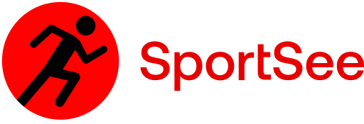

   
# trak your performance !

This application allow you to track your workout performance.

## Prerequisites

- NodeJS (version 12.18)
- Yarn
- Recharts
- Jsdoc
- Axios

## Launching the project

- Fork the repository
- Clone it on your computer.
- The yarn command will allow you to install the dependencies.
- The `yarn dev` command will allow you to run the micro API.
( `https://github.com/CHE-MIMA/Sport-see-API-Back`)
- `npm install` will allow you to install the dependencies on the front-end ( `https://github.com/CHE-MIMA/sport-see`)
- `npm start` on the front-end ( `https://github.com/CHE-MIMA/sport-see`), from starting,  Default port : 3001
- They have userId 12 and 18, 
from 12 go to (`localhost:3001/user/12`);
from 18 go to (`localhost:3001/user/18`);

# Back-end endpoints :

- `http://localhost:3000/user/${userId}` retrieves information from a user. This first endpoint includes the user id, user information (first name, last name and age), the current day's score (todayScore) and key data (calorie, macronutrient, etc.).
- `http://localhost:3000/user/${userId}/activity` retrieves a user's activity day by day with kilograms and calories.
- `http://localhost:3000/user/${userId}/average-sessions` retrieves the average sessions of a user per day. The week starts on Monday.
- `http://localhost:3000/user/${userId}/performance` retrieves a user's performance (energy, endurance, etc.).

Warning, currently only two users have been mocked. They have userId 12 and 18 respectively.
